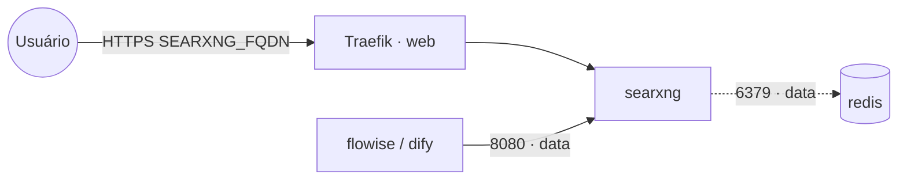

# searxng — SearXNG (meta-busca)

**SearXNG** é um meta-mecanismo de busca (agrega vários buscadores, sem rastreamento). Muito usado como
backend de **web search** para agentes/RAG (`flowise`, `dify`, etc.). Publicado via Traefik v3 com TLS e
disponível na rede `data` para outras stacks conectarem por `searxng:8080`.

## Arquitetura

## Variáveis de ambiente
| Variável | Obrigatória | Default | Descrição |
|---|---|---|---|
| `SEARXNG_FQDN` | sim | — | domínio público (ex.: `busca.exemplo.com`) |
| `SEARXNG_SECRET` | sim | — | segredo da instância (`openssl rand -hex 32`) |
| `SEARXNG_REDIS_URL` | não | — | Redis para rate-limit/cache (ex.: `redis://redis:6379/4`) |
| `SEARXNG_IMAGE_TAG` | não | `latest` | tag da imagem searxng/searxng |
| `PROXY_NET` | não | `web` | rede externa do Traefik |
| `DATA_NET` | não | `data` | rede overlay dos serviços compartilhados |
| `WORKER_HOSTNAME` | não | — | fixa o volume num nó (cluster multi-worker) |

## Pré-requisitos
- **Hardware mínimo:** 0.5 vCPU · 256 MB RAM · 2 GB disco
- **Hardware ideal:** 1 vCPU · 512 MB RAM · 5 GB disco
- Stack `balancer` (Traefik) + rede `web`; DNS de `SEARXNG_FQDN` apontando para o host.
- Rede `data` (para uso por agentes e/ou Redis).

## Uso
1. Defina `SEARXNG_SECRET` e faça o deploy (o `settings.yml` é gerado no volume no primeiro start).
2. Acesse `https://SEARXNG_FQDN`.
3. **Para usar como API (agentes/RAG):** edite `searxng-config:/etc/searxng/settings.yml` e habilite o
   formato JSON em `search.formats: [html, json]`; consuma em `http://searxng:8080/search?q=...&format=json`.

## Troubleshooting
| Sintoma | Causa | Ação |
|---|---|---|
| API retorna 403/HTML | formato JSON não habilitado | adicionar `json` em `search.formats` no settings.yml |
| "Too many requests" | rate-limit sem Redis | apontar `SEARXNG_REDIS_URL` para o Redis compartilhado |
| Config some ao reagendar | volume local ao nó (multi-worker) | fixar `node.hostname` via `WORKER_HOSTNAME` |
| 404/sem TLS | DNS não aponta / fora da `web` | conferir rede/labels e DNS |
