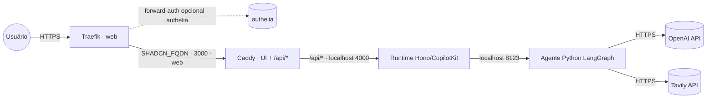

# shadcn-generator — AI shadcn Component Generator

Descreva uma UI em **linguagem natural** e receba um **componente shadcn/ui interativo**,
renderizado ao vivo no chat e **exportável como React**. UI **Vite + React** com **CopilotKit** +
**AG-UI**, runtime **Hono/CopilotKit** (Node/tsx) e agente **Python LangGraph/FastAPI** (OpenAI,
com **Tavily** para web search).

Empacotado numa **imagem combinada** publicada em `ghcr.io/marcelofmatos/ai-shadcn-component-generator`
(fonte: [awesome-llm-apps](https://github.com/Shubhamsaboo/awesome-llm-apps), MIT · repo de build
[marcelofmatos/ai-shadcn-component-generator](https://github.com/marcelofmatos/ai-shadcn-component-generator)).

| Componente | Porta | Papel |
|---|---|---|
| Caddy | `3000` | Exposto via Traefik; serve a UI estática e faz proxy de `/api/*` para o runtime |
| Runtime (Hono/CopilotKit, `tsx`) | `4000` | Interno (mesmo container); ponte UI ↔ agente |
| Agente (Python LangGraph/FastAPI) | `8123` | Interno (mesmo container); chama OpenAI e usa Tavily |

> **Sem login próprio.** A UI não tem autenticação — não deixe aberta no público. Proteja com
> forward-auth (stack `authelia`) descomentando a label de middleware no compose.
>
> **Stateless.** Não há volume nem banco — o estado vive em memória por sessão.

## Arquitetura



## Variáveis de ambiente

| Variável | Obrigatória | Default | Descrição |
|---|:---:|---|---|
| `SHADCN_FQDN` | ✅ | — | Domínio (FQDN) onde a UI é exposta |
| `OPENAI_API_KEY` | ✅ | — | Chave OpenAI usada pelo agente e pelo runtime CopilotKit |
| `TAVILY_API_KEY` | ✅ | — | Chave Tavily usada pelo agente (web search/extract/crawl) |
| `SHADCN_IMAGE_TAG` | ❌ | `latest` | Tag da imagem no GHCR |
| `PROXY_NET` | ❌ | `web` | Rede externa do proxy (Traefik) |
| `SHADCN_AUTH_MIDDLEWARE` | ❌ | — | Middleware de forward-auth (ex.: `authelia@docker`), se descomentar a label |

## Pré-requisitos

- **Swarm** (App Template `type 2`): rede externa `web` já criada pelo Traefik.
- **Standalone** (`docker compose`): crie a rede antes — `docker network create web`.
- Chaves **OpenAI** e **Tavily** válidas.

## Uso

1. No Portainer, escolha o template **shadcn-generator — AI shadcn Component Generator** e preencha
   `SHADCN_FQDN`, `OPENAI_API_KEY` e `TAVILY_API_KEY`.
2. Aponte o DNS de `SHADCN_FQDN` para o proxy; o Traefik emite o certificado.
3. Acesse `https://SHADCN_FQDN` e peça um componente (ex.: "build a pricing card with a monthly/annual toggle").

Fora do Portainer:

```bash
cp .env.example .env   # preencha as obrigatórias
docker compose -f docker-compose.standalone.yml up -d
```

## Troubleshooting

| Sintoma | Causa | Ação |
|---|---|---|
| 502 / Bad Gateway logo após subir | Caddy ainda subindo, ou runtime/agente falhou ao iniciar | Aguarde ~30s; veja os logs do serviço (`app`) |
| Chat responde com erro de autenticação | `OPENAI_API_KEY` ausente ou inválida | Confira a chave nas variáveis da stack |
| Busca na web não funciona | `TAVILY_API_KEY` ausente ou inválida | Confira a chave nas variáveis da stack |
| UI abre mas os componentes não geram | Chave OpenAI sem cota ou sem acesso ao modelo | Valide a chave em platform.openai.com |
| Certificado TLS não emitido | DNS não aponta para o proxy | Ajuste o registro A/AAAA de `SHADCN_FQDN` |
| UI acessível sem senha no público | forward-auth não configurado | Descomente a label de middleware e configure a stack `authelia` |
