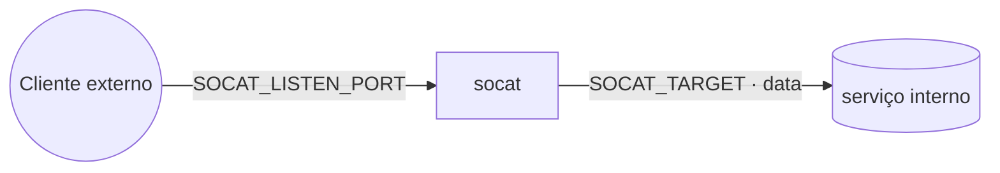

# socat — relay TCP

**socat** encaminha uma porta publicada no nó para um destino alcançável pelo container. Caso de uso
típico: expor de forma controlada um serviço **interno** (um banco na rede `data`, por exemplo) para
fora do cluster, sem publicar a porta do próprio serviço.

## Arquitetura

## Variáveis de ambiente
| Variável | Obrigatória | Default | Descrição |
|---|---|---|---|
| `SOCAT_LISTEN_PORT` | sim | — | porta que o socat escuta e publica no nó (ex.: `3306`) |
| `SOCAT_TARGET` | sim | — | destino `host:porta` alcançável pelo container (ex.: `mariadb:3306`) |
| `SOCAT_IMAGE_TAG` | não | `latest` | tag da imagem alpine/socat |
| `PROXY_NET` | não | `web` | rede externa do Traefik (para alcançar serviços ali) |
| `DATA_NET` | não | `data` | rede overlay dos serviços compartilhados |

## Pré-requisitos
- **Hardware mínimo:** 0.25 vCPU · 32 MB RAM · 1 GB disco
- **Hardware ideal:** 0.5 vCPU · 64 MB RAM · 2 GB disco
- O destino (`SOCAT_TARGET`) precisa estar numa rede que o socat alcança (`data` ou `web`).
- Porta `SOCAT_LISTEN_PORT` liberada no firewall do host.

## Uso
1. Defina, por exemplo, `SOCAT_LISTEN_PORT=3306` e `SOCAT_TARGET=mariadb:3306` e faça o deploy.
2. Conecte de fora do cluster em `<host-do-no>:3306` — o tráfego é repassado ao `mariadb` na `data`.

## Segurança
- O socat **não autentica nem cifra** — ele só repassa TCP. Exponha apenas o necessário e proteja a
  porta publicada no firewall. Para acesso público, prefira o serviço-alvo com TLS/credenciais próprios.

## Troubleshooting
| Sintoma | Causa | Ação |
|---|---|---|
| Conexão recusada na porta | porta não publicada / firewall | conferir `SOCAT_LISTEN_PORT` e o firewall do nó |
| Conecta mas não responde | `SOCAT_TARGET` inalcançável / rede errada | conferir host:porta e se o socat está na rede do alvo |
| Porta já em uso | outra coisa usa a porta no nó | escolher outra `SOCAT_LISTEN_PORT` |
