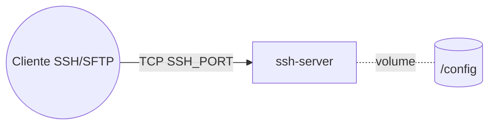

# ssh-server — OpenSSH Server (SSH/SFTP)

Servidor **OpenSSH** (imagem linuxserver) para acesso **SSH/SFTP** ao cluster. Não usa Traefik (SSH é
TCP, não HTTP): publica a porta diretamente no nó. Recomenda-se autenticação por **chave pública**.

## Arquitetura

## Variáveis de ambiente
| Variável | Obrigatória | Default | Descrição |
|---|---|---|---|
| `SSH_USER` | sim | `sftp` | nome do usuário criado |
| `SSH_PUBLIC_KEY` | recomendado | — | chave pública SSH autorizada (login por chave) |
| `SSH_PASSWORD_ACCESS` | não | `false` | habilita login por senha (use com `SSH_USER_PASSWORD`) |
| `SSH_USER_PASSWORD` | não | — | senha do usuário (se `SSH_PASSWORD_ACCESS=true`) |
| `SSH_SUDO_ACCESS` | não | `false` | concede sudo ao usuário |
| `SSH_PORT` | não | `2222` | porta SSH publicada no nó |
| `SSH_HOSTNAME` | não | `ssh-server` | hostname do container |
| `SSH_PUID` / `SSH_PGID` | não | `1000` | UID/GID do usuário (dono dos arquivos) |
| `TZ` | não | `America/Sao_Paulo` | fuso horário |
| `SSH_IMAGE_TAG` | não | `latest` | tag da imagem lscr.io/linuxserver/openssh-server |
| `WORKER_HOSTNAME` | não | — | fixa o volume num nó (cluster multi-worker) |

## Pré-requisitos
- **Hardware mínimo:** 0.5 vCPU · 128 MB RAM · 5 GB disco
- **Hardware ideal:** 1 vCPU · 256 MB RAM · 10 GB disco
- Porta `SSH_PORT` liberada no firewall do host (e DNS/IP conhecido para conectar).

## Uso
1. Informe `SSH_USER` e `SSH_PUBLIC_KEY` (conteúdo da sua `id_*.pub`) e faça o deploy.
2. Conecte: `ssh -p ${SSH_PORT:-2222} ${SSH_USER}@<host-do-no>` (ou `sftp -P ...`).
3. Para senha em vez de chave, defina `SSH_PASSWORD_ACCESS=true` e `SSH_USER_PASSWORD` (menos seguro).

## Troubleshooting
| Sintoma | Causa | Ação |
|---|---|---|
| `Permission denied (publickey)` | chave pública ausente/errada | conferir `SSH_PUBLIC_KEY` (linha inteira da `.pub`) |
| Conexão recusada | porta não publicada/bloqueada | conferir `SSH_PORT` e o firewall do nó |
| Arquivos com dono errado | `PUID/PGID` divergentes | ajustar `SSH_PUID`/`SSH_PGID` |
| Config some ao migrar | volume local ao nó (multi-worker) | fixar `node.hostname` via `WORKER_HOSTNAME` |
