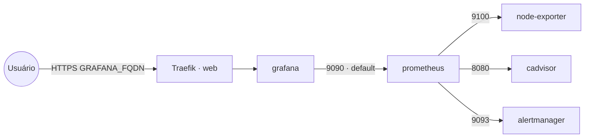

# swarmprom — monitoramento de Docker Swarm

Stack de monitoramento nativo para **Docker Swarm**, baseada no projeto
[stefanprodan/swarmprom](https://github.com/stefanprodan/swarmprom), com as **tags das imagens
modernizadas** (todas em `latest` por padrão e parametrizáveis por variável de ambiente).

Coleta métricas de hosts (node-exporter) e containers (cAdvisor), armazena no **Prometheus**,
gera alertas via **Alertmanager** e visualiza no **Grafana**. Apenas o **Grafana** é publicado
via Traefik v3 com TLS; os demais serviços ficam só na rede interna `default`.

## Componentes

| Serviço | Imagem | Modo | Exposto | Descrição |
|---|---|---|---|---|
| `grafana` | `grafana/grafana` | replicated (worker) | **sim** (Traefik) | Dashboards e visualização |
| `prometheus` | `prom/prometheus` | replicated (worker) | não (rede `default`) | Coleta e armazena métricas |
| `alertmanager` | `prom/alertmanager` | replicated (worker) | não (rede `default`) | Roteia e envia alertas |
| `node-exporter` | `prom/node-exporter` | global | não (rede `default`) | Métricas de host (CPU, RAM, disco) |
| `cadvisor` | `gcr.io/cadvisor/cadvisor` | global | não (rede `default`) | Métricas de containers |

> `node-exporter` e `cadvisor` rodam em **modo global** (uma instância por nó, em todos os nós,
> incluindo o manager) e montam paths do host (`/proc`, `/sys`, `/`, `/var/run`,
> `/var/lib/docker`). Por isso **não** têm constraint `node.role == worker`.

## Arquitetura



## Variáveis de ambiente

| Variável | Obrigatória | Default | Descrição |
|---|---|---|---|
| `SWARMPROM_GRAFANA_FQDN` | sim | — | domínio público do Grafana (ex.: `grafana.exemplo.com`) |
| `GRAFANA_ADMIN_PASSWORD` | sim | — | senha do admin do Grafana (segredo) |
| `GRAFANA_ADMIN_USER` | não | `admin` | usuário admin do Grafana |
| `PROMETHEUS_RETENTION` | não | `15d` | retenção dos dados no Prometheus |
| `PROMETHEUS_IMAGE_TAG` | não | `latest` | tag da imagem Prometheus |
| `GRAFANA_IMAGE_TAG` | não | `latest` | tag da imagem Grafana |
| `ALERTMANAGER_IMAGE_TAG` | não | `latest` | tag da imagem Alertmanager |
| `NODE_EXPORTER_IMAGE_TAG` | não | `latest` | tag da imagem node-exporter |
| `CADVISOR_IMAGE_TAG` | não | `latest` | tag da imagem cAdvisor |
| `WORKER_HOSTNAME` | não | — | hostname do worker para fixar serviços com volume (multi-worker) |
| `PROXY_NET` | não | `web` | rede externa do Traefik |

## Pré-requisitos
- Docker Swarm inicializado.
- Traefik (stack `balancer`) e rede `web` ativos: `docker network create --driver overlay --attachable web`.
- DNS de `SWARMPROM_GRAFANA_FQDN` apontando para o host (porta 80 acessível para o desafio ACME).

## Uso
```bash
export SWARMPROM_GRAFANA_FQDN=grafana.exemplo.com GRAFANA_ADMIN_PASSWORD=...
docker stack deploy -c swarmprom/docker-compose.yml swarmprom
```
Acesse `https://SWARMPROM_GRAFANA_FQDN` e faça login com `GRAFANA_ADMIN_USER` /
`GRAFANA_ADMIN_PASSWORD`. Em **Connections → Data sources**, adicione o Prometheus apontando
para `http://prometheus:9090` (alcançável pela rede interna `default`).

## Configuração adicional (importante)
Esta stack sobe com uma **configuração mínima inline** (flags/env) para ser deployável de imediato:

- **Prometheus** inicia com `--config.file=/etc/prometheus/prometheus.yml`. A imagem traz um
  `prometheus.yml` padrão que só faz scrape de si mesmo. Para coletar métricas de Swarm,
  node-exporter (`node-exporter:9100`), cAdvisor (`cadvisor:8080`) e do próprio cluster, **monte
  um `prometheus.yml` customizado** (e regras de alerta) via Docker config/volume.
- **Grafana** sobe sem datasources/dashboards pré-provisionados. Para automatizar, monte arquivos
  de **provisioning** (`/etc/grafana/provisioning/datasources` e `.../dashboards`).
- **Alertmanager** usa `--config.file=/etc/alertmanager/alertmanager.yml` (config padrão da
  imagem). Para roteamento real (Slack, e-mail etc.), monte um `alertmanager.yml` customizado.

Use o projeto [stefanprodan/swarmprom](https://github.com/stefanprodan/swarmprom) como
**referência** para os arquivos de `prometheus.yml`, regras de alerta, datasources e dashboards
do Grafana. As **tags das imagens foram atualizadas** em relação ao projeto original (que está
arquivado), então valide a compatibilidade das configs com as versões mais recentes.

## Troubleshooting
| Sintoma | Causa | Ação |
|---|---|---|
| Grafana 404 / sem TLS | fora da rede `web` / DNS não aponta | conferir `networks`, `deploy.labels` e DNS |
| Sem dados no Grafana | datasource Prometheus não configurado | adicionar datasource `http://prometheus:9090` |
| Prometheus só mostra a si mesmo | usando `prometheus.yml` padrão da imagem | montar `prometheus.yml` com os scrape targets |
| node-exporter/cAdvisor não sobem | falta de acesso aos paths do host | confirmar mounts `/proc`, `/sys`, `/`, `/var/run`, `/var/lib/docker` |
| Dados somem após reagendar | volume local ao nó em cluster multi-worker | definir `WORKER_HOSTNAME` e descomentar o constraint `node.hostname` |
| Alertas não chegam | `alertmanager.yml` padrão sem receivers | montar `alertmanager.yml` customizado |
