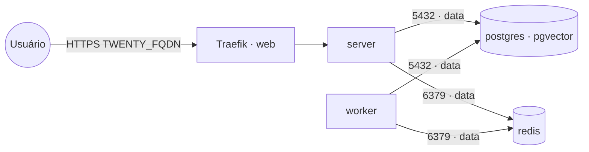

# twenty — Twenty CRM

**Twenty** (CRM open source moderno, UI estilo Notion/Airtable: contatos, empresas, oportunidades,
workflows) publicado via Traefik v3 com TLS. Reaproveita os serviços compartilhados da rede `data`:
**PostgreSQL** (stack `postgres-pgvector`) e **Redis** (stack `redis`) — não sobe banco/cache próprios.

## Componentes
| Serviço | Imagem | Função |
|---|---|---|
| `server` | `twentycrm/twenty` | API + front-end, exposto via Traefik na porta 3000 |
| `worker` | `twentycrm/twenty` | Processa filas/jobs assíncronos (BullMQ no Redis) |

## Arquitetura



## Variáveis de ambiente
| Variável | Obrigatória | Default | Descrição |
|---|---|---|---|
| `TWENTY_FQDN` | sim | — | domínio público (ex.: `twenty.exemplo.com`) |
| `TWENTY_APP_SECRET` | sim | — | segredo da aplicação (gere com `openssl rand -base64 32`) |
| `TWENTY_DB_PASSWORD` | sim | — | senha do usuário do PostgreSQL |
| `TWENTY_DB_HOST` | não | `postgres` | host do PostgreSQL na rede `data` |
| `TWENTY_DB_PORT` | não | `5432` | porta do PostgreSQL |
| `TWENTY_DB_USER` | não | `postgres` | usuário do PostgreSQL |
| `TWENTY_DB_NAME` | não | `twenty` | banco usado pelo Twenty |
| `TWENTY_REDIS_URL` | não | `redis://redis:6379` | URI do Redis (com senha: `redis://default:<senha>@redis:6379`) |
| `TWENTY_IMAGE_TAG` | não | `latest` | tag da imagem twentycrm/twenty (recomendado fixar, ex.: `v0.42.0`) |
| `PROXY_NET` | não | `web` | rede externa do Traefik |
| `DATA_NET` | não | `data` | rede overlay dos serviços compartilhados |
| `WORKER_HOSTNAME` | não | — | fixa os serviços num nó (cluster multi-worker) |

## Pré-requisitos
- Stack `balancer` (Traefik) + rede `web`; DNS de `TWENTY_FQDN` apontando para o host.
- Rede `data`: `docker network create --driver overlay --attachable data`.
- Stack **`postgres-pgvector`** (ou outro PostgreSQL) na rede `data` com um banco para o Twenty:
  ```sql
  CREATE DATABASE twenty;
  ```
- Stack **`redis`** na rede `data` (se tiver senha, use a URI autenticada em `TWENTY_REDIS_URL`).

## Uso
1. Crie o banco `twenty` no PostgreSQL compartilhado (acima) e gere o `TWENTY_APP_SECRET`.
2. Faça o deploy. O `server` aplica as migrações automaticamente no primeiro start.
3. Acesse `https://TWENTY_FQDN` e crie a conta/workspace inicial.

> Fixe `TWENTY_IMAGE_TAG` numa versão específica em produção: o schema evolui entre releases e
> `latest` pode aplicar migrações inesperadas.

## Troubleshooting
| Sintoma | Causa | Ação |
|---|---|---|
| Erro de conexão com o banco | `data` ausente / banco `twenty` não criado / senha errada | criar a rede, o banco e conferir `TWENTY_DB_*` |
| Login/sessão falha após restart | `TWENTY_APP_SECRET` mudou ou vazio | definir um `APP_SECRET` fixo e persistente |
| Jobs/sincronizações travadas | `worker` parado ou sem Redis | garantir o `worker` ativo e o Redis acessível |
| 404/sem TLS | fora da `web` / DNS não aponta | conferir rede/labels e DNS |
| Anexos somem ao reagendar | volume local ao nó (multi-worker) | fixar `node.hostname` via `WORKER_HOSTNAME` |
