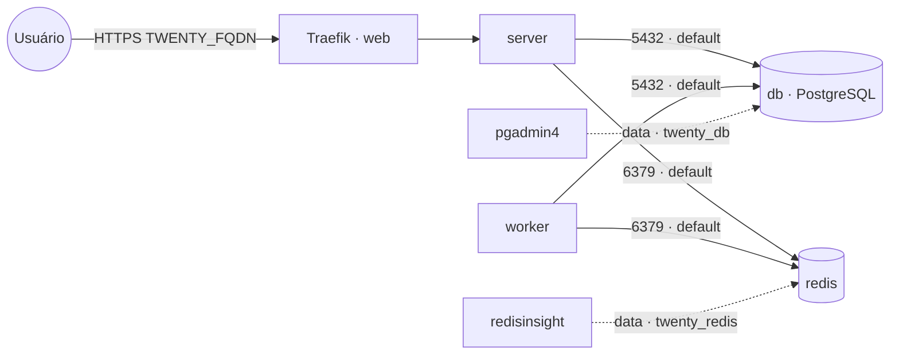

# twenty — Twenty CRM

**Twenty** (CRM open source moderno, UI estilo Notion/Airtable: contatos, empresas, oportunidades,
workflows) publicado via Traefik v3 com TLS, com **PostgreSQL e Redis embarcados** (serviços `db` e
`redis` próprios da stack). Banco e cache ficam na rede interna `default` e também na `data` **só**
para ferramentas de administração (pgadmin4/redisinsight) os alcançarem como `twenty_db` e
`twenty_redis`. Volumes dedicados = fácil migrar de host.

## Componentes
| Serviço | Imagem | Função |
|---|---|---|
| `server` | `twentycrm/twenty` | API + front-end, exposto via Traefik na porta 3000 |
| `worker` | `twentycrm/twenty` | Processa filas/jobs assíncronos (BullMQ no Redis) |
| `db` | `postgres` | PostgreSQL embarcado da stack |
| `redis` | `redis` | Cache/filas embarcado da stack |

## Arquitetura

## Variáveis de ambiente
| Variável | Obrigatória | Default | Descrição |
|---|---|---|---|
| `TWENTY_FQDN` | sim | — | domínio público (ex.: `twenty.exemplo.com`) |
| `TWENTY_APP_SECRET` | sim | — | segredo da aplicação (gere com `openssl rand -base64 32`) |
| `TWENTY_DB_PASSWORD` | sim | — | senha do PostgreSQL (usada pelo app e pelo `db`) |
| `TWENTY_DB_HOST` | não | `db` | host do banco (serviço interno desta stack) |
| `TWENTY_DB_PORT` | não | `5432` | porta do PostgreSQL |
| `TWENTY_DB_USER` | não | `postgres` | usuário do PostgreSQL |
| `TWENTY_DB_NAME` | não | `twenty` | banco usado pelo Twenty |
| `TWENTY_REDIS_URL` | não | `redis://redis:6379` | URI do Redis (com senha: `redis://default:<senha>@redis:6379`) |
| `TWENTY_IMAGE_TAG` | não | `latest` | tag da imagem twentycrm/twenty (recomendado fixar, ex.: `v0.42.0`) |
| `TWENTY_DB_IMAGE_TAG` | não | `16-alpine` | tag da imagem PostgreSQL |
| `TWENTY_REDIS_IMAGE_TAG` | não | `7-alpine` | tag da imagem Redis |
| `PROXY_NET` | não | `web` | rede externa do Traefik |
| `DATA_NET` | não | `data` | rede externa p/ ferramentas de admin alcançarem banco/cache |
| `WORKER_HOSTNAME` | não | — | fixa os serviços num nó (cluster multi-worker) |

## Pré-requisitos
- **Hardware mínimo:** 2 vCPU · 2 GB RAM · 20 GB disco
- **Hardware ideal:** 4 vCPU · 4 GB RAM · 40 GB disco
- Stack `balancer` (Traefik) + rede `web`; DNS de `TWENTY_FQDN` apontando para o host.
- Rede `data`: `docker network create --driver overlay --attachable data` (usada pelas ferramentas de admin).
- **Não** precisa das stacks `postgres-pgvector`/`redis`: banco e cache sobem junto. Para administrá-los,
  aponte o `pgadmin4` para o host `twenty_db` (porta 5432) e o `redisinsight` para `twenty_redis`
  (porta 6379) na rede `data`.

## Uso
1. Faça o deploy informando `TWENTY_FQDN`, `TWENTY_APP_SECRET` e `TWENTY_DB_PASSWORD`. O banco/usuário
   são criados automaticamente na primeira subida e o `server` aplica as migrações.
2. Acesse `https://TWENTY_FQDN` e crie a conta/workspace inicial.

> Fixe `TWENTY_IMAGE_TAG` numa versão específica em produção: o schema evolui entre releases e
> `latest` pode aplicar migrações inesperadas.

### Migrar para outro host
Como banco e cache são dedicados, basta migrar os volumes `db-data`, `redis-data` e `twenty-data`
para o novo nó e subir a stack lá — sem mexer em serviços compartilhados de outras stacks.

## Troubleshooting
| Sintoma | Causa | Ação |
|---|---|---|
| Erro de conexão com o banco | `db` ainda subindo / senha divergente | aguardar o `db`; conferir `TWENTY_DB_PASSWORD` igual no app e no banco |
| `duplicate key ... pg_namespace_nspname_index` na 1ª subida | `server` e `worker` migrando o banco vazio ao mesmo tempo (Swarm ignora `depends_on`) | já tratado: o `worker` tem `DISABLE_DB_MIGRATIONS=true` (só o `server` migra). Se o banco ficou meio-migrado, **zere o volume `db-data`** e suba de novo |
| `could not translate host name "postgres"` | `TWENTY_DB_HOST` apontando p/ host inexistente | usar `TWENTY_DB_HOST=db` (serviço desta stack) ou remover a variável (default já é `db`) |
| Login/sessão falha após restart | `TWENTY_APP_SECRET` mudou ou vazio | definir um `APP_SECRET` fixo e persistente |
| Jobs/sincronizações travadas | `worker` parado ou sem Redis | garantir o `worker` ativo e o `redis` acessível |
| 404/sem TLS | fora da `web` / DNS não aponta | conferir rede/labels e DNS |
| Dados somem após restart | volume do banco/cache resetado | preservar os volumes `db-data`/`redis-data` |
| Anexos somem ao reagendar | volume local ao nó (multi-worker) | fixar `node.hostname` via `WORKER_HOSTNAME` |
| pgadmin4/redisinsight não acham o serviço | host errado | usar `twenty_db:5432` / `twenty_redis:6379` na rede `data` |
