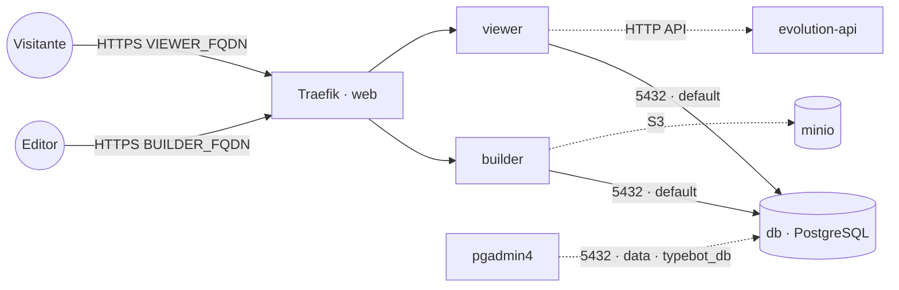

# typebot — Typebot (construtor de chatbots)

**Typebot** (builder visual de chatbots/fluxos conversacionais) publicado via Traefik v3 com TLS, com
**PostgreSQL embarcado** (serviço `db` próprio da stack). O banco fica na rede interna `default` e
também na `data` **só** para ferramentas de administração (pgadmin4) o alcançarem como `typebot_db`.
Os fluxos publicados podem ser entregues no WhatsApp via stack **`evolution-api`**.

## Componentes
| Serviço | Imagem | Função |
|---|---|---|
| `builder` | `baptistearno/typebot-builder` | Editor de fluxos + autenticação (`TYPEBOT_BUILDER_FQDN`) |
| `viewer` | `baptistearno/typebot-viewer` | Runtime que serve os bots publicados (`TYPEBOT_VIEWER_FQDN`) |
| `db` | `postgres` | PostgreSQL embarcado (próprio da stack); admin via `typebot_db` na rede `data` |

## Arquitetura

## Variáveis de ambiente
| Variável | Obrigatória | Default | Descrição |
|---|---|---|---|
| `TYPEBOT_BUILDER_FQDN` | sim | — | domínio do editor (ex.: `typebot.exemplo.com`) |
| `TYPEBOT_VIEWER_FQDN` | sim | — | domínio do runtime/bots (ex.: `bot.exemplo.com`) |
| `TYPEBOT_ENCRYPTION_SECRET` | sim | — | segredo de criptografia, 32 chars (gere com `openssl rand -base64 24`) |
| `TYPEBOT_DB_PASSWORD` | sim | — | senha do PostgreSQL (usada pelos apps e pelo `db`) |
| `TYPEBOT_ADMIN_EMAIL` | não | — | e-mail que vira admin no primeiro acesso |
| `TYPEBOT_DISABLE_SIGNUP` | não | `true` | bloqueia auto-cadastro de novos usuários |
| `TYPEBOT_DB_HOST` | não | `db` | host do banco (serviço interno desta stack) |
| `TYPEBOT_DB_PORT` | não | `5432` | porta do PostgreSQL |
| `TYPEBOT_DB_USER` | não | `postgres` | usuário do PostgreSQL |
| `TYPEBOT_DB_NAME` | não | `typebot` | banco usado pelo Typebot |
| `TYPEBOT_S3_ENDPOINT` | não | — | endpoint S3/MinIO para mídias (ex.: `s3.exemplo.com`); vazio = sem upload |
| `TYPEBOT_S3_ACCESS_KEY` | não | — | access key do bucket |
| `TYPEBOT_S3_SECRET_KEY` | não | — | secret key do bucket |
| `TYPEBOT_S3_BUCKET` | não | `typebot` | nome do bucket |
| `TYPEBOT_S3_PORT` | não | `443` | porta do endpoint S3 |
| `TYPEBOT_S3_SSL` | não | `true` | usar TLS no endpoint S3 |
| `TYPEBOT_IMAGE_TAG` | não | `latest` | tag das imagens typebot-builder/viewer |
| `TYPEBOT_DB_IMAGE_TAG` | não | `16-alpine` | tag da imagem PostgreSQL |
| `PROXY_NET` | não | `web` | rede externa do Traefik |
| `DATA_NET` | não | `data` | rede externa p/ ferramentas de admin alcançarem o banco |

## Pré-requisitos
- Stack `balancer` (Traefik) + rede `web`; DNS de `TYPEBOT_BUILDER_FQDN` e `TYPEBOT_VIEWER_FQDN`
  apontando para o host.
- Rede `data`: `docker network create --driver overlay --attachable data` (usada pelas ferramentas de admin).
- **Não** precisa da stack `postgres-pgvector`: o banco sobe junto. Para administrá-lo, aponte o
  `pgadmin4` para o host `typebot_db` (porta 5432) na rede `data`.
- (Opcional) Stack **`minio`** para armazenar imagens/arquivos dos fluxos — preencha `TYPEBOT_S3_*`.

## Uso
1. Gere o `TYPEBOT_ENCRYPTION_SECRET`. O banco/usuário são criados automaticamente na primeira subida.
2. Faça o deploy. O `builder` aplica as migrações no primeiro start.
3. Acesse `https://TYPEBOT_BUILDER_FQDN`, faça login (o `TYPEBOT_ADMIN_EMAIL` vira admin) e crie seu
   primeiro bot. Os bots publicados ficam em `https://TYPEBOT_VIEWER_FQDN`.
4. **WhatsApp via Evolution API:** use o bloco *WhatsApp* do Typebot ou um webhook que dispara a
   Evolution API (`POST /message/sendText/<instância>` com header `apikey`) para entregar as mensagens.

### Migrar para outro host
Como o banco é dedicado, basta migrar o volume `db-data` para o novo nó e subir a stack lá — sem
mexer em banco compartilhado de outras stacks.

## Troubleshooting
| Sintoma | Causa | Ação |
|---|---|---|
| Erro de conexão com o banco | `db` ainda subindo / senha divergente | aguardar o `db`; conferir `TYPEBOT_DB_PASSWORD` igual nos apps e no banco |
| Login redireciona errado | `NEXTAUTH_URL` ≠ domínio do builder | conferir `TYPEBOT_BUILDER_FQDN` |
| Bot publicado não abre | `NEXT_PUBLIC_VIEWER_URL` incorreto / viewer fora da `web` | conferir `TYPEBOT_VIEWER_FQDN` e labels |
| Upload de imagem falha | S3/MinIO não configurado | preencher `TYPEBOT_S3_*` e criar o bucket |
| 404/sem TLS | DNS não aponta / fora da `web` | conferir rede/labels e DNS |
| pgadmin4 não acha o banco | host errado | usar `typebot_db:5432` na rede `data` |
