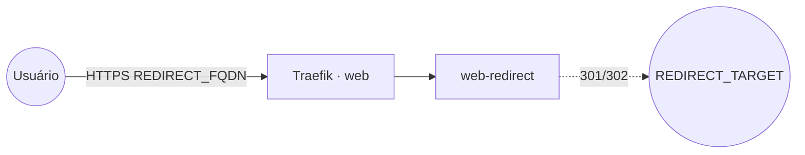

# web-redirect — redirecionador HTTP

Redireciona todo o tráfego de um domínio para uma **URL de destino** (301/302), publicado via Traefik
v3 com TLS. Útil para domínios antigos/alternativos, mudança de endereço ou apontar um host para outro
serviço.

## Arquitetura

## Variáveis de ambiente
| Variável | Obrigatória | Default | Descrição |
|---|---|---|---|
| `REDIRECT_FQDN` | sim | — | domínio de origem que será redirecionado (ex.: `antigo.exemplo.com`) |
| `REDIRECT_TARGET` | sim | — | URL de destino (ex.: `https://novo.exemplo.com`) |
| `REDIRECT_TYPE` | não | `redirect` | `redirect` (302 temporário) ou `redirect permanent` (301) |
| `REDIRECT_IMAGE_TAG` | não | `latest` | tag da imagem morbz/docker-web-redirect |
| `PROXY_NET` | não | `web` | rede externa do Traefik |

## Pré-requisitos
- Stack `balancer` (Traefik) + rede `web`; DNS de `REDIRECT_FQDN` apontando para o host.

## Uso
1. Defina `REDIRECT_FQDN` (origem) e `REDIRECT_TARGET` (destino) e faça o deploy.
2. Acessos a `https://REDIRECT_FQDN` passam a ser redirecionados para `REDIRECT_TARGET`.
3. Para redirecionamento permanente (301), use `REDIRECT_TYPE="redirect permanent"`.

## Troubleshooting
| Sintoma | Causa | Ação |
|---|---|---|
| Não redireciona | `REDIRECT_TARGET` vazio/errado | conferir a URL de destino completa (com `https://`) |
| 404/sem TLS | DNS não aponta / fora da `web` | conferir rede/labels e DNS |
| Navegador "lembra" do destino errado | 301 fica em cache | testar em aba anônima; usar 302 enquanto valida |
