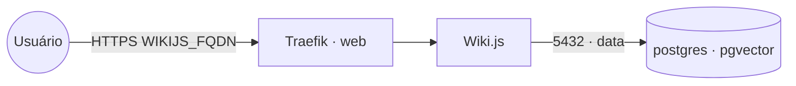

# wikijs — Wiki.js

**Wiki.js** — wiki moderno **baseado em Markdown** (com editor visual/markdown, busca, versionamento,
controle de acesso). Publicado via Traefik v3 com TLS. Reaproveita o **PostgreSQL compartilhado**
(stack `postgres-pgvector`) na rede `data` — não sobe banco próprio. O conteúdo fica no banco, então
o serviço é stateless.

## Arquitetura



## Variáveis de ambiente
| Variável | Obrigatória | Default | Descrição |
|---|---|---|---|
| `WIKIJS_FQDN` | sim | — | domínio público (ex.: `wiki.exemplo.com`) |
| `WIKIJS_DB_PASSWORD` | sim | — | senha do usuário do PostgreSQL |
| `WIKIJS_DB_HOST` | não | `postgres` | host do PostgreSQL na rede `data` |
| `WIKIJS_DB_PORT` | não | `5432` | porta do PostgreSQL |
| `WIKIJS_DB_USER` | não | `wikijs` | usuário do banco |
| `WIKIJS_DB_NAME` | não | `wikijs` | banco usado pelo Wiki.js |
| `WIKIJS_IMAGE_TAG` | não | `2` | tag da imagem requarks/wiki |
| `PROXY_NET` | não | `web` | rede externa do Traefik |
| `DATA_NET` | não | `data` | rede overlay dos bancos compartilhados |

## Pré-requisitos
- Stack `balancer` (Traefik) + rede `web`; DNS de `WIKIJS_FQDN` apontando para o host.
- Rede `data`: `docker network create --driver overlay --attachable data`.
- Stack **`postgres-pgvector`** (ou outro PostgreSQL) na rede `data`, com banco e usuário para o Wiki.js:
  ```sql
  CREATE DATABASE wikijs;
  CREATE USER wikijs WITH PASSWORD '<senha>';
  GRANT ALL PRIVILEGES ON DATABASE wikijs TO wikijs;
  ```

## Uso
1. Crie o banco/usuário no PostgreSQL compartilhado (acima).
2. Faça o deploy e acesse `https://WIKIJS_FQDN` — a primeira tela é o setup do administrador.
3. Crie páginas escolhendo o editor **Markdown**. Conteúdo e histórico ficam no Postgres.

## Troubleshooting
| Sintoma | Causa | Ação |
|---|---|---|
| Não carrega / erro de conexão ao banco | `data` ausente / banco não criado / senha errada | criar rede+banco, conferir `WIKIJS_DB_*` |
| 404/sem TLS | fora da `web` / DNS não aponta | conferir rede/labels e DNS |
| Setup reaparece | banco resetado/trocado | usar o mesmo banco persistente do `postgres-pgvector` |
| Assets/uploads grandes | armazenamento padrão no banco | configurar um storage (local/S3) no admin do Wiki.js |
