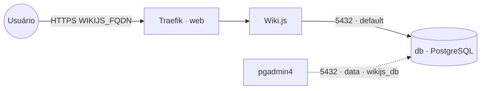

# wikijs — Wiki.js

**Wiki.js** — wiki moderno **baseado em Markdown** (com editor visual/markdown, busca, versionamento,
controle de acesso). Publicado via Traefik v3 com TLS, com **PostgreSQL embarcado** (serviço `db`
próprio da stack). O banco fica na rede interna `default` e também na `data` **só** para ferramentas
de administração (pgadmin4) o alcançarem como `wikijs_db`. O conteúdo fica no banco, então o serviço
da app é stateless; volume dedicado = fácil migrar de host.

## Arquitetura

## Variáveis de ambiente
| Variável | Obrigatória | Default | Descrição |
|---|---|---|---|
| `WIKIJS_FQDN` | sim | — | domínio público (ex.: `wiki.exemplo.com`) |
| `WIKIJS_DB_PASSWORD` | sim | — | senha do PostgreSQL (usada pelo app e pelo `db`) |
| `WIKIJS_DB_HOST` | não | `db` | host do banco (serviço interno desta stack) |
| `WIKIJS_DB_PORT` | não | `5432` | porta do PostgreSQL |
| `WIKIJS_DB_USER` | não | `wikijs` | usuário do banco |
| `WIKIJS_DB_NAME` | não | `wikijs` | banco usado pelo Wiki.js |
| `WIKIJS_IMAGE_TAG` | não | `2` | tag da imagem requarks/wiki |
| `WIKIJS_DB_IMAGE_TAG` | não | `16-alpine` | tag da imagem PostgreSQL |
| `PROXY_NET` | não | `web` | rede externa do Traefik |
| `DATA_NET` | não | `data` | rede externa p/ ferramentas de admin alcançarem o banco |

## Pré-requisitos
- **Hardware mínimo:** 1 vCPU · 1 GB RAM · 10 GB disco
- **Hardware ideal:** 2 vCPU · 2 GB RAM · 20 GB disco
- Stack `balancer` (Traefik) + rede `web`; DNS de `WIKIJS_FQDN` apontando para o host.
- Rede `data`: `docker network create --driver overlay --attachable data` (usada pelas ferramentas de admin).
- **Não** precisa da stack `postgres-pgvector`: o banco sobe junto. Para administrá-lo, aponte o
  `pgadmin4` para o host `wikijs_db` (porta 5432) na rede `data`.

## Uso
1. Faça o deploy informando `WIKIJS_FQDN` e `WIKIJS_DB_PASSWORD`. O banco/usuário são criados
   automaticamente na primeira subida.
2. Acesse `https://WIKIJS_FQDN` — a primeira tela é o setup do administrador.
3. Crie páginas escolhendo o editor **Markdown**. Conteúdo e histórico ficam no banco embarcado.

### Migrar para outro host
Como o banco é dedicado, basta migrar o volume `db-data` para o novo nó e subir a stack lá — sem
mexer em banco compartilhado de outras stacks.

## Troubleshooting
| Sintoma | Causa | Ação |
|---|---|---|
| Não carrega / erro de conexão ao banco | `db` ainda subindo / senha divergente | aguardar o `db`; conferir `WIKIJS_DB_PASSWORD` igual no app e no banco |
| 404/sem TLS | fora da `web` / DNS não aponta | conferir rede/labels e DNS |
| Setup reaparece | volume do banco resetado | preservar o volume `db-data` |
| pgadmin4 não acha o banco | host errado | usar `wikijs_db:5432` na rede `data` |
| Assets/uploads grandes | armazenamento padrão no banco | configurar um storage (local/S3) no admin do Wiki.js |
