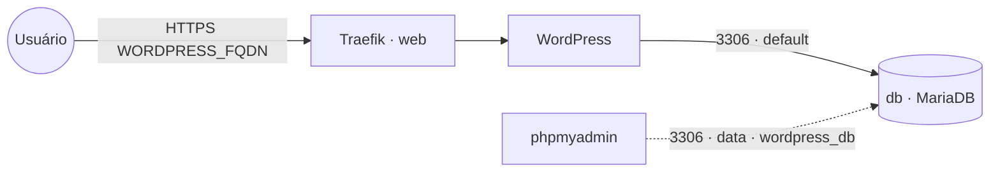

# wordpress — WordPress

**WordPress** (CMS/blog) publicado via Traefik v3 com TLS, com **MariaDB embarcado** (serviço `db`
próprio da stack). O banco fica na rede interna `default` e também na `data` **só** para ferramentas
de administração (phpmyadmin) o alcançarem como `wordpress_db`. Volume dedicado = fácil migrar de host.

## Arquitetura

## Variáveis de ambiente
| Variável | Obrigatória | Default | Descrição |
|---|---|---|---|
| `WORDPRESS_FQDN` | sim | — | domínio público (ex.: `blog.exemplo.com`) |
| `WORDPRESS_DB_PASSWORD` | sim | — | senha do usuário do banco (usada pelo app e pelo `db`) |
| `WORDPRESS_DB_ROOT_PASSWORD` | sim | — | senha **root** do MariaDB embarcado |
| `WORDPRESS_DB_HOST` | não | `db` | host do banco (serviço interno desta stack) |
| `WORDPRESS_DB_NAME` | não | `wordpress` | banco usado pelo WordPress |
| `WORDPRESS_DB_USER` | não | `wordpress` | usuário do banco |
| `WORDPRESS_TABLE_PREFIX` | não | `wp_` | prefixo das tabelas |
| `WORDPRESS_CONFIG_EXTRA` | não | _(vazio)_ | PHP extra para o `wp-config.php` (ex.: forçar HTTPS) |
| `WORDPRESS_IMAGE_TAG` | não | `php8.3-apache` | tag da imagem WordPress |
| `WORDPRESS_DB_IMAGE_TAG` | não | `11` | tag da imagem MariaDB |
| `PROXY_NET` | não | `web` | rede externa do Traefik |
| `DATA_NET` | não | `data` | rede externa p/ ferramentas de admin alcançarem o banco |
| `WORKER_HOSTNAME` | não | — | fixa o volume num nó (cluster multi-worker) |

## Pré-requisitos
- Stack `balancer` (Traefik) + rede `web`; DNS de `WORDPRESS_FQDN` apontando para o host.
- Rede `data`: `docker network create --driver overlay --attachable data` (usada pelas ferramentas de admin).
- **Não** precisa da stack `mariadb`: o banco sobe junto. Para administrá-lo, aponte o `phpmyadmin`
  para o host `wordpress_db` (porta 3306) na rede `data`.

## Uso
1. Faça o deploy informando `WORDPRESS_FQDN`, `WORDPRESS_DB_PASSWORD` e `WORDPRESS_DB_ROOT_PASSWORD`.
   O banco e o usuário são criados automaticamente na primeira subida.
2. Acesse `https://WORDPRESS_FQDN` para o instalador do WordPress.
3. Atrás do proxy, force HTTPS via `WORDPRESS_CONFIG_EXTRA`, ex.:
   `define('FORCE_SSL_ADMIN', true); if (strpos($_SERVER['HTTP_X_FORWARDED_PROTO'] ?? '', 'https') !== false) $_SERVER['HTTPS'] = 'on';`

### Migrar para outro host
Como o banco é dedicado, basta migrar dois volumes (`wordpress-data` e `db-data`) para o novo nó e
subir a stack lá — sem mexer em banco compartilhado de outras stacks.

## Troubleshooting
| Sintoma | Causa | Ação |
|---|---|---|
| "Error establishing a database connection" | `db` ainda subindo / senha divergente | aguardar o `db`; conferir `WORDPRESS_DB_PASSWORD` igual no app e no banco |
| `db` não inicia na primeira vez | falta `WORDPRESS_DB_ROOT_PASSWORD` | definir a senha root (obrigatória) |
| Loop de redirecionamento / mixed content | WordPress não sabe que está atrás de HTTPS | usar `WORDPRESS_CONFIG_EXTRA` (FORCE_SSL + X-Forwarded-Proto) |
| 404/sem TLS | fora da `web` / DNS não aponta | conferir rede/labels e DNS |
| phpmyadmin não acha o banco | host errado | usar `wordpress_db:3306` na rede `data` |
| Uploads/plugins/banco somem ao reagendar | volume local ao nó (multi-worker) | fixar `node.hostname` via `WORKER_HOSTNAME` |
