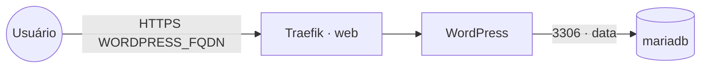

# wordpress — WordPress

**WordPress** (CMS/blog) publicado via Traefik v3 com TLS. Reaproveita o **MariaDB compartilhado**
(stack `mariadb`) na rede `data` — não sobe banco próprio.

## Arquitetura



## Variáveis de ambiente
| Variável | Obrigatória | Default | Descrição |
|---|---|---|---|
| `WORDPRESS_FQDN` | sim | — | domínio público (ex.: `blog.exemplo.com`) |
| `WORDPRESS_DB_PASSWORD` | sim | — | senha do usuário do banco |
| `WORDPRESS_DB_HOST` | não | `mariadb` | host do MariaDB na rede `data` |
| `WORDPRESS_DB_NAME` | não | `wordpress` | banco usado pelo WordPress |
| `WORDPRESS_DB_USER` | não | `wordpress` | usuário do banco |
| `WORDPRESS_TABLE_PREFIX` | não | `wp_` | prefixo das tabelas |
| `WORDPRESS_CONFIG_EXTRA` | não | _(vazio)_ | PHP extra para o `wp-config.php` (ex.: forçar HTTPS) |
| `WORDPRESS_IMAGE_TAG` | não | `php8.3-apache` | tag da imagem WordPress |
| `PROXY_NET` | não | `web` | rede externa do Traefik |
| `DATA_NET` | não | `data` | rede overlay dos bancos compartilhados |
| `WORKER_HOSTNAME` | não | — | fixa o volume num nó (cluster multi-worker) |

## Pré-requisitos
- Stack `balancer` (Traefik) + rede `web`; DNS de `WORDPRESS_FQDN` apontando para o host.
- Rede `data`: `docker network create --driver overlay --attachable data`.
- Stack **`mariadb`** na rede `data`, com banco e usuário para o WordPress:
  ```sql
  CREATE DATABASE wordpress CHARACTER SET utf8mb4 COLLATE utf8mb4_unicode_ci;
  CREATE USER 'wordpress'@'%' IDENTIFIED BY '<senha>';
  GRANT ALL PRIVILEGES ON wordpress.* TO 'wordpress'@'%';
  FLUSH PRIVILEGES;
  ```

## Uso
1. Crie o banco/usuário no MariaDB compartilhado (acima).
2. Faça o deploy e acesse `https://WORDPRESS_FQDN` para o instalador do WordPress.
3. Atrás do proxy, force HTTPS via `WORDPRESS_CONFIG_EXTRA`, ex.:
   `define('FORCE_SSL_ADMIN', true); if (strpos($_SERVER['HTTP_X_FORWARDED_PROTO'] ?? '', 'https') !== false) $_SERVER['HTTPS'] = 'on';`

## Troubleshooting
| Sintoma | Causa | Ação |
|---|---|---|
| "Error establishing a database connection" | `data` ausente / banco não criado / senha errada | criar rede+banco, conferir `WORDPRESS_DB_*` |
| Loop de redirecionamento / mixed content | WordPress não sabe que está atrás de HTTPS | usar `WORDPRESS_CONFIG_EXTRA` (FORCE_SSL + X-Forwarded-Proto) |
| 404/sem TLS | fora da `web` / DNS não aponta | conferir rede/labels e DNS |
| Uploads/plugins somem ao reagendar | volume local ao nó (multi-worker) | fixar `node.hostname` via `WORKER_HOSTNAME` |
