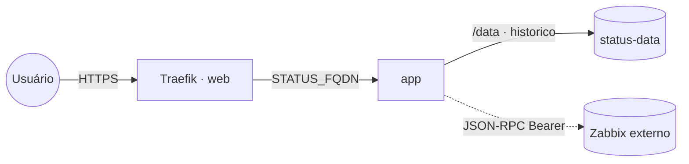

# zabbix-status-page — Página de status pública (Zabbix)

Página de status pública no estilo das páginas hospedadas, alimentada pela **API do
Zabbix**. Mostra o estado geral do ambiente, o detalhamento por componente / host group,
os incidentes em aberto e o histórico de uptime dos últimos 90 dias. Publicada via
**Traefik v3** com TLS Let's Encrypt.

Imagem pública: [`ghcr.io/marcelofmatos/zabbix-status-page`](https://github.com/marcelofmatos/zabbix-status-page)
(código-fonte em `marcelofmatos/zabbix-status-page`). **Consome um Zabbix externo** (≥ 6.4)
via API JSON-RPC com token — esta stack **não** sobe um Zabbix; para isso use a stack
[`zabbix`](../zabbix/).

## Arquitetura



O poller consulta o Zabbix a cada `POLL_INTERVAL_SECONDS`, monta o snapshot, agrega por
host group e persiste o histórico de uptime no volume `status-data`. Se o Zabbix ficar
indisponível, a página degrada graciosamente (mantém o último snapshot e marca como
desatualizada).

## Variáveis de ambiente

| Variável | Obrigatória | Default | Descrição |
|---|---|---|---|
| `STATUS_FQDN` | sim | — | Domínio público da página (ex.: `status.exemplo.com`). |
| `ZABBIX_URL` | sim | — | URL base do Zabbix (ex.: `https://zabbix.exemplo.com/zabbix/`). `api_jsonrpc.php` é derivado dela. |
| `ZABBIX_TOKEN` | sim | — | Token de API (Bearer) — use um usuário **somente leitura**. Segredo. |
| `PAGE_TITLE` | não | `Status` | Título exibido na página. |
| `TZ` | não | `UTC` | Fuso usado para fechar o bucket diário do histórico. |
| `ZABBIX_STATUS_BY_GROUPS` | não | `on` | `on` agrega e exibe o status por host group. |
| `ZABBIX_KNOWLEADS` | não | `on` | `on` exibe os incidentes em aberto. |
| `ZABBIX_KNOWLEADS_COMMENTS` | não | `on` | `on` inclui os comentários de acknowledge nos incidentes. |
| `ZABBIX_GROUPS_IDS` | não | vazio | CSV de IDs de host groups a incluir. Vazio = todos. |
| `ZABBIX_HOSTS_IDS` | não | vazio | CSV de IDs de hosts a incluir. Vazio = todos. |
| `ZABBIX_MIN_SEVERITY` | não | `0` | Severidade mínima (0–5) considerada como problema. |
| `POLL_INTERVAL_SECONDS` | não | `60` | Intervalo entre coletas no Zabbix. |
| `HISTORY_DAYS` | não | `90` | Janela do histórico de uptime, em dias. |
| `APP_IMAGE_TAG` | não | `latest` | Tag da imagem. |
| `PROXY_NET` | não | `web` | Rede externa do proxy (Traefik). |

## Pré-requisitos

- Rede externa `web` (stack [`balancer`](../balancer/) / Traefik v3 com `letsencryptresolver`).
- DNS do `STATUS_FQDN` apontando para o host.
- Um Zabbix **≥ 6.4** acessível a partir do container e um **token de API**
  (Zabbix → Users → API tokens; prefira um usuário read-only restrito aos grupos exibidos).
- Standalone: crie a rede antes (`docker network create web`).

## Uso

No Portainer (App Templates), selecione **zabbix-status-page** e preencha o formulário.
Via `docker compose`:

```bash
cp .env.example .env   # preencha STATUS_FQDN, ZABBIX_URL, ZABBIX_TOKEN
docker stack deploy -c docker-compose.yml zabbix-status-page      # Swarm
# ou, standalone:
docker compose -f docker-compose.standalone.yml up -d
```

Acesse `https://STATUS_FQDN`. As barras de uptime começam vazias e vão preenchendo a
partir do primeiro start (histórico honesto, cresce até `HISTORY_DAYS`).

## Troubleshooting

| Sintoma | Causa provável | Ação |
|---|---|---|
| Página presa em "dados desatualizados" | Zabbix inacessível, URL/token errados ou Zabbix < 6.4 | Confira `ZABBIX_URL`/`ZABBIX_TOKEN`; teste a API; garanta Zabbix ≥ 6.4 (auth por header Bearer). |
| Sem incidentes mesmo havendo problemas | `ZABBIX_KNOWLEADS=off` ou token sem permissão nos grupos | Ligue `ZABBIX_KNOWLEADS`; use um usuário com leitura nos host groups. |
| Histórico não persiste após recriar | Volume `status-data` não fixado ao nó (multi-worker) | Fixe `WORKER_HOSTNAME` e descomente o constraint de hostname (volume é local ao nó). |
| 404 no Traefik | Serviço fora da rede `web` ou FQDN/DNS errado | Confira `STATUS_FQDN`, DNS e a rede `web`. |
| 502 Bad Gateway | App ainda subindo ou porta errada | Aguarde o healthcheck; a porta interna é `8080`. |
