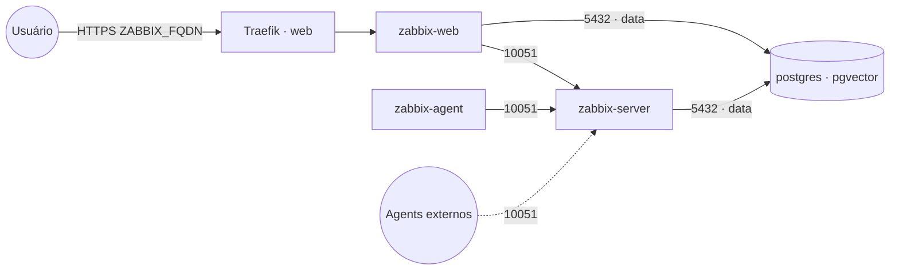

# zabbix — Zabbix (monitoramento)

**Zabbix** (monitoramento de infraestrutura/serviços) publicado via Traefik v3 com TLS. Reaproveita o
**PostgreSQL** compartilhado (stack `postgres-pgvector`) na rede `data` — não sobe banco próprio.

## Componentes
| Serviço | Imagem | Função |
|---|---|---|
| `zabbix-server` | `zabbix/zabbix-server-pgsql` | Coletor/processador; trapper na porta 10051 |
| `zabbix-web` | `zabbix/zabbix-web-nginx-pgsql` | Interface web, exposta via Traefik (porta 8080) |
| `zabbix-agent` | `zabbix/zabbix-agent2` | Auto-monitoração do próprio Zabbix |

## Arquitetura



## Variáveis de ambiente
| Variável | Obrigatória | Default | Descrição |
|---|---|---|---|
| `ZABBIX_FQDN` | sim | — | domínio da UI (ex.: `zabbix.exemplo.com`) |
| `ZABBIX_DB_PASSWORD` | sim | — | senha do usuário do PostgreSQL |
| `ZABBIX_DB_HOST` | não | `postgres` | host do PostgreSQL na rede `data` |
| `ZABBIX_DB_PORT` | não | `5432` | porta do PostgreSQL |
| `ZABBIX_DB_USER` | não | `postgres` | usuário do PostgreSQL |
| `ZABBIX_DB_NAME` | não | `zabbix` | banco usado pelo Zabbix |
| `ZABBIX_TIMEZONE` | não | `America/Sao_Paulo` | fuso horário do PHP (UI) |
| `ZABBIX_IMAGE_TAG` | não | `alpine-7.0-latest` | tag das imagens Zabbix (LTS 7.0) |
| `ZABBIX_SERVER_PORT` | não | `10051` | porta do trapper publicada (só se descomentar `ports`) |
| `PROXY_NET` | não | `web` | rede externa do Traefik |
| `DATA_NET` | não | `data` | rede overlay dos serviços compartilhados |

## Pré-requisitos
- Stack `balancer` (Traefik) + rede `web`; DNS de `ZABBIX_FQDN` apontando para o host.
- Rede `data`: `docker network create --driver overlay --attachable data`.
- Stack **`postgres-pgvector`** na rede `data` com um banco para o Zabbix:
  ```sql
  CREATE DATABASE zabbix;
  ```
  > O `zabbix-server` importa o schema automaticamente na primeira execução (banco vazio).

## Uso
1. Crie o banco `zabbix` e faça o deploy. Aguarde o `zabbix-server` importar o schema (primeiro start
   pode levar alguns minutos).
2. Acesse `https://ZABBIX_FQDN`. Login inicial padrão do Zabbix: **Admin / zabbix** — troque a senha
   imediatamente.
3. Para receber dados de agents externos, descomente o bloco `ports` do `zabbix-server` (10051).

## Troubleshooting
| Sintoma | Causa | Ação |
|---|---|---|
| UI mostra "Database error" | banco não criado / senha errada / schema ainda importando | criar o banco, conferir `ZABBIX_DB_*` e aguardar o server |
| "Zabbix server is not running" no topo | `zabbix-web` não alcança o `zabbix-server` | conferir `ZBX_SERVER_HOST=zabbix-server` e a rede `default` |
| Horários errados na UI | `PHP_TZ` incorreto | ajustar `ZABBIX_TIMEZONE` |
| 404/sem TLS | DNS não aponta / fora da `web` | conferir rede/labels e DNS |
