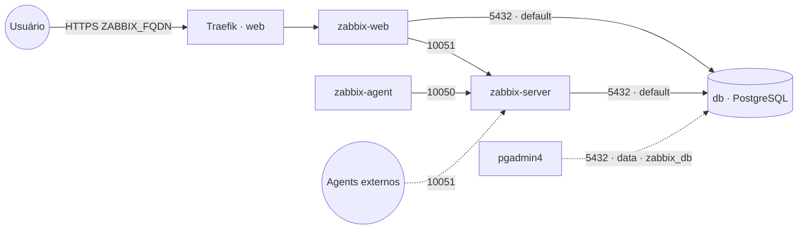

# zabbix — Zabbix (monitoramento)

**Zabbix** (monitoramento de infraestrutura/serviços) publicado via Traefik v3 com TLS, com
**PostgreSQL embarcado** (serviço `db` próprio da stack). O banco fica na rede interna `default` e
também na `data` **só** para ferramentas de administração (pgadmin4) o alcançarem como `zabbix_db`.
Os dados de monitoração ficam no banco; volume dedicado = fácil migrar de host.

## Componentes
| Serviço | Imagem | Função |
|---|---|---|
| `zabbix-server` | `zabbix/zabbix-server-pgsql` | Coletor/processador; trapper na porta 10051 |
| `zabbix-web` | `zabbix/zabbix-web-nginx-pgsql` | Interface web, exposta via Traefik (porta 8080) |
| `zabbix-agent` | `zabbix/zabbix-agent2` | Auto-monitoração do próprio Zabbix |
| `db` | `postgres` | PostgreSQL embarcado (banco próprio da stack) |

## Arquitetura

## Variáveis de ambiente
| Variável | Obrigatória | Default | Descrição |
|---|---|---|---|
| `ZABBIX_FQDN` | sim | — | domínio da UI (ex.: `zabbix.exemplo.com`) |
| `ZABBIX_DB_PASSWORD` | sim | — | senha do PostgreSQL (usada pelo Zabbix e pelo `db`) |
| `ZABBIX_DB_HOST` | não | `db` | host do banco (serviço interno desta stack) |
| `ZABBIX_DB_PORT` | não | `5432` | porta do PostgreSQL |
| `ZABBIX_DB_USER` | não | `postgres` | usuário do PostgreSQL |
| `ZABBIX_DB_NAME` | não | `zabbix` | banco usado pelo Zabbix |
| `ZABBIX_TIMEZONE` | não | `America/Sao_Paulo` | fuso horário do PHP (UI) |
| `ZABBIX_IMAGE_TAG` | não | `alpine-7.0-latest` | tag das imagens Zabbix (LTS 7.0) |
| `ZABBIX_DB_IMAGE_TAG` | não | `16-alpine` | tag da imagem PostgreSQL |
| `ZABBIX_SERVER_PORT` | não | `10051` | porta do trapper publicada (só se descomentar `ports`) |
| `PROXY_NET` | não | `web` | rede externa do Traefik |
| `DATA_NET` | não | `data` | rede externa p/ ferramentas de admin alcançarem o banco |

## Pré-requisitos
- **Hardware mínimo:** 1 vCPU · 1 GB RAM · 10 GB disco
- **Hardware ideal:** 2 vCPU · 2 GB RAM · 20 GB disco
- Stack `balancer` (Traefik) + rede `web`; DNS de `ZABBIX_FQDN` apontando para o host.
- Rede `data`: `docker network create --driver overlay --attachable data` (usada pelas ferramentas de admin).
- **Não** precisa da stack `postgres-pgvector`: o banco sobe junto. Para administrá-lo, aponte o
  `pgadmin4` para o host `zabbix_db` (porta 5432) na rede `data`.

## Uso
1. Faça o deploy informando `ZABBIX_FQDN` e `ZABBIX_DB_PASSWORD`. O banco/usuário são criados
   automaticamente na primeira subida, e o `zabbix-server` importa o schema num banco vazio (primeiro
   start pode levar alguns minutos).
2. Acesse `https://ZABBIX_FQDN`. Login inicial padrão do Zabbix: **Admin / zabbix** — troque a senha
   imediatamente.
3. Para receber dados de agents externos, descomente o bloco `ports` do `zabbix-server` (10051).

### Migrar para outro host
Como o banco é dedicado, basta migrar o volume `db-data` para o novo nó e subir a stack lá — sem
mexer em banco compartilhado de outras stacks.

## Troubleshooting
| Sintoma | Causa | Ação |
|---|---|---|
| UI mostra "Database error" | `db` ainda subindo / senha divergente / schema importando | aguardar o `db` e o server; conferir `ZABBIX_DB_PASSWORD` igual no Zabbix e no banco |
| "Zabbix server is not running" no topo | `zabbix-web` não alcança o `zabbix-server` | conferir `ZBX_SERVER_HOST=zabbix-server` e a rede `default` |
| Setup/schema reaparece | volume do banco resetado | preservar o volume `db-data` |
| pgadmin4 não acha o banco | host errado | usar `zabbix_db:5432` na rede `data` |
| Horários errados na UI | `PHP_TZ` incorreto | ajustar `ZABBIX_TIMEZONE` |
| 404/sem TLS | DNS não aponta / fora da `web` | conferir rede/labels e DNS |
